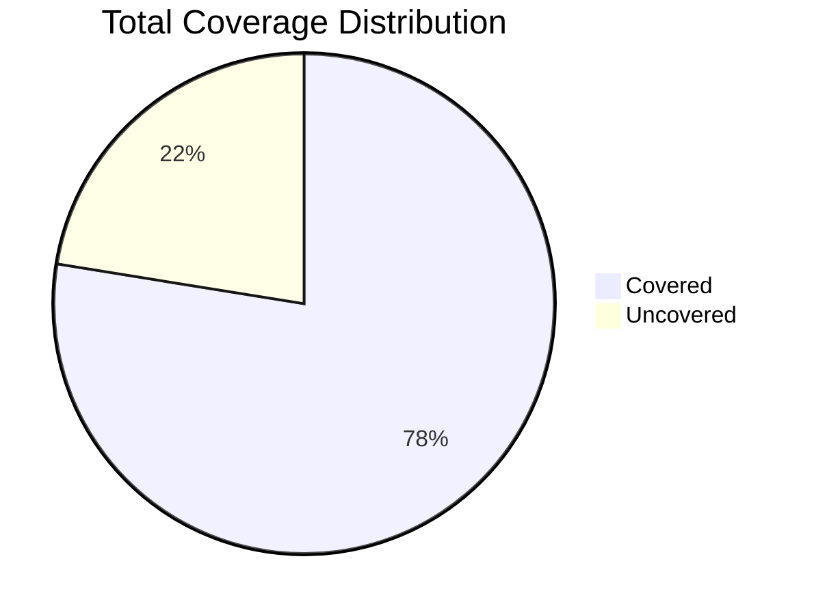

# Unified Coverage Report

## Summary

**Total Statement Coverage:** 77.55%

| Category | Percentage | Covered/Total |
|---|---|---|
| Statements | 77.55% | 11119/14336 |
| Branches | 77.35% | 2965/3833 |
| Functions | 75.62% | 1250/1653 |
| Lines | 80.91% | 8195/10128 |

## Visualizations

### Coverage Overview

```mermaid
graph TD
    node0["public"]
    style node0 fill:#e0e0e0,stroke:#333,stroke-width:1px,stroke-dasharray: 5 5
    node1["client.js <br/> 69.63%"]
    style node1 fill:#ffeb3b,stroke:#333,stroke-width:1px
    node0 --> node1
    node2["js"]
    style node2 fill:#e0e0e0,stroke:#333,stroke-width:1px,stroke-dasharray: 5 5
    node0 --> node2
    node3["AccessibilityManager.js <br/> 88.62%"]
    style node3 fill:#4caf50,stroke:#333,stroke-width:1px
    node2 --> node3
    node4["AnalysisManager.js <br/> 88.82%"]
    style node4 fill:#4caf50,stroke:#333,stroke-width:1px
    node2 --> node4
    node5["ArrowManager.js <br/> 96.02%"]
    style node5 fill:#4caf50,stroke:#333,stroke-width:1px
    node2 --> node5
    node6["AuthManager.js <br/> 31.06%"]
    style node6 fill:#f44336,stroke:#333,stroke-width:1px
    node2 --> node6
    node7["AutoSaveManager.js <br/> 78.76%"]
    style node7 fill:#ffeb3b,stroke:#333,stroke-width:1px
    node2 --> node7
    node8["BatterySaver.js <br/> 79.31%"]
    style node8 fill:#ffeb3b,stroke:#333,stroke-width:1px
    node2 --> node8
    node9["BoardEditor.js <br/> 91.11%"]
    style node9 fill:#4caf50,stroke:#333,stroke-width:1px
    node2 --> node9
    node10["BoardInfoRenderer.js <br/> 95.47%"]
    style node10 fill:#4caf50,stroke:#333,stroke-width:1px
    node2 --> node10
    node11["BoardRenderer.js <br/> 76.16%"]
    style node11 fill:#ffeb3b,stroke:#333,stroke-width:1px
    node2 --> node11
    node12["ChatManager.js <br/> 60.41%"]
    style node12 fill:#ffeb3b,stroke:#333,stroke-width:1px
    node2 --> node12
    node13["ClientUtils.js <br/> 90.12%"]
    style node13 fill:#4caf50,stroke:#333,stroke-width:1px
    node2 --> node13
    node14["CloudEngineManager.js <br/> 24.67%"]
    style node14 fill:#f44336,stroke:#333,stroke-width:1px
    node2 --> node14
    node15["DeveloperManager.js <br/> 56.52%"]
    style node15 fill:#ffeb3b,stroke:#333,stroke-width:1px
    node2 --> node15
    node16["EngineProxy.js <br/> 89.47%"]
    style node16 fill:#4caf50,stroke:#333,stroke-width:1px
    node2 --> node16
    node17["ExternalActions.js <br/> 57.48%"]
    style node17 fill:#ffeb3b,stroke:#333,stroke-width:1px
    node2 --> node17
    node18["FenManager.js <br/> 33.33%"]
    style node18 fill:#f44336,stroke:#333,stroke-width:1px
    node2 --> node18
    node19["GameManager.js <br/> 89%"]
    style node19 fill:#4caf50,stroke:#333,stroke-width:1px
    node2 --> node19
    node20["GraphManager.js <br/> 100%"]
    style node20 fill:#4caf50,stroke:#333,stroke-width:1px
    node2 --> node20
    node21["InfoManager.js <br/> 87.86%"]
    style node21 fill:#4caf50,stroke:#333,stroke-width:1px
    node2 --> node21
    node22["LanguageManager.js <br/> 94.73%"]
    style node22 fill:#4caf50,stroke:#333,stroke-width:1px
    node2 --> node22
    node23["LeaderboardManager.js <br/> 96.34%"]
    style node23 fill:#4caf50,stroke:#333,stroke-width:1px
    node2 --> node23
    node24["LocalEngineManager.js <br/> 81.15%"]
    style node24 fill:#4caf50,stroke:#333,stroke-width:1px
    node2 --> node24
    node25["MoveHandler.js <br/> 94.13%"]
    style node25 fill:#4caf50,stroke:#333,stroke-width:1px
    node2 --> node25
    node26["MoveListManager.js <br/> 43.65%"]
    style node26 fill:#f44336,stroke:#333,stroke-width:1px
    node2 --> node26
    node27["OpeningExplorer.js <br/> 47.36%"]
    style node27 fill:#f44336,stroke:#333,stroke-width:1px
    node2 --> node27
    node28["PgnManager.js <br/> 30.33%"]
    style node28 fill:#f44336,stroke:#333,stroke-width:1px
    node2 --> node28
    node29["SettingsManager.js <br/> 63.12%"]
    style node29 fill:#ffeb3b,stroke:#333,stroke-width:1px
    node2 --> node29
    node30["SocketHandler.js <br/> 92.64%"]
    style node30 fill:#4caf50,stroke:#333,stroke-width:1px
    node2 --> node30
    node31["SoundManager.js <br/> 69.33%"]
    style node31 fill:#ffeb3b,stroke:#333,stroke-width:1px
    node2 --> node31
    node32["TrainingManager.js <br/> 90.47%"]
    style node32 fill:#4caf50,stroke:#333,stroke-width:1px
    node2 --> node32
    node33["TreeManager.js <br/> 18.78%"]
    style node33 fill:#f44336,stroke:#333,stroke-width:1px
    node2 --> node33
    node34["TutorialManager.js <br/> 31.13%"]
    style node34 fill:#f44336,stroke:#333,stroke-width:1px
    node2 --> node34
    node35["UIConstants.js <br/> 98%"]
    style node35 fill:#4caf50,stroke:#333,stroke-width:1px
    node2 --> node35
    node36["UIManager.js <br/> 83.57%"]
    style node36 fill:#4caf50,stroke:#333,stroke-width:1px
    node2 --> node36
    node37["UIOptionFactory.js <br/> 76.53%"]
    style node37 fill:#ffeb3b,stroke:#333,stroke-width:1px
    node2 --> node37
    node38["VisualEffects.js <br/> 55.45%"]
    style node38 fill:#ffeb3b,stroke:#333,stroke-width:1px
    node2 --> node38
    node39["VisualizationManager.js <br/> 83.01%"]
    style node39 fill:#4caf50,stroke:#333,stroke-width:1px
    node2 --> node39
    node40["tournament.js <br/> 33.49%"]
    style node40 fill:#f44336,stroke:#333,stroke-width:1px
    node0 --> node40
    node41["src"]
    style node41 fill:#e0e0e0,stroke:#333,stroke-width:1px,stroke-dasharray: 5 5
    node42["Bench.js <br/> 5.4%"]
    style node42 fill:#f44336,stroke:#333,stroke-width:1px
    node41 --> node42
    node43["Bitboard.js <br/> 97.76%"]
    style node43 fill:#4caf50,stroke:#333,stroke-width:1px
    node41 --> node43
    node44["Board.js <br/> 96.37%"]
    style node44 fill:#4caf50,stroke:#333,stroke-width:1px
    node41 --> node44
    node45["BoardPerft.js <br/> 95.83%"]
    style node45 fill:#4caf50,stroke:#333,stroke-width:1px
    node41 --> node45
    node46["BoardVerify.js <br/> 75%"]
    style node46 fill:#ffeb3b,stroke:#333,stroke-width:1px
    node41 --> node46
    node47["BoardZobrist.js <br/> 98.79%"]
    style node47 fill:#4caf50,stroke:#333,stroke-width:1px
    node41 --> node47
    node48["Evaluation.js <br/> 96.3%"]
    style node48 fill:#4caf50,stroke:#333,stroke-width:1px
    node41 --> node48
    node49["EvaluationConstants.js <br/> 100%"]
    style node49 fill:#4caf50,stroke:#333,stroke-width:1px
    node41 --> node49
    node50["FenParser.js <br/> 98.21%"]
    style node50 fill:#4caf50,stroke:#333,stroke-width:1px
    node41 --> node50
    node51["MoveGenerator.js <br/> 98.42%"]
    style node51 fill:#4caf50,stroke:#333,stroke-width:1px
    node41 --> node51
    node52["MoveSorter.js <br/> 100%"]
    style node52 fill:#4caf50,stroke:#333,stroke-width:1px
    node41 --> node52
    node53["NNUE.js <br/> 74.63%"]
    style node53 fill:#ffeb3b,stroke:#333,stroke-width:1px
    node41 --> node53
    node54["PawnHash.js <br/> 100%"]
    style node54 fill:#4caf50,stroke:#333,stroke-width:1px
    node41 --> node54
    node55["PerftTT.js <br/> 100%"]
    style node55 fill:#4caf50,stroke:#333,stroke-width:1px
    node41 --> node55
    node56["Piece.js <br/> 100%"]
    style node56 fill:#4caf50,stroke:#333,stroke-width:1px
    node41 --> node56
    node57["Polyglot.js <br/> 84.05%"]
    style node57 fill:#4caf50,stroke:#333,stroke-width:1px
    node41 --> node57
    node58["PolyglotConstants.js <br/> 100%"]
    style node58 fill:#4caf50,stroke:#333,stroke-width:1px
    node41 --> node58
    node59["Quiescence.js <br/> 81.81%"]
    style node59 fill:#4caf50,stroke:#333,stroke-width:1px
    node41 --> node59
    node60["SEE.js <br/> 100%"]
    style node60 fill:#4caf50,stroke:#333,stroke-width:1px
    node41 --> node60
    node61["San.js <br/> 95%"]
    style node61 fill:#4caf50,stroke:#333,stroke-width:1px
    node41 --> node61
    node62["Search.js <br/> 83.5%"]
    style node62 fill:#4caf50,stroke:#333,stroke-width:1px
    node41 --> node62
    node63["SearchDebug.js <br/> 89.65%"]
    style node63 fill:#4caf50,stroke:#333,stroke-width:1px
    node41 --> node63
    node64["SearchHeuristics.js <br/> 91.66%"]
    style node64 fill:#4caf50,stroke:#333,stroke-width:1px
    node41 --> node64
    node65["SearchPruning.js <br/> 75%"]
    style node65 fill:#ffeb3b,stroke:#333,stroke-width:1px
    node41 --> node65
    node66["SearchUtils.js <br/> 79.62%"]
    style node66 fill:#ffeb3b,stroke:#333,stroke-width:1px
    node41 --> node66
    node67["StrengthLimiter.js <br/> 47.36%"]
    style node67 fill:#f44336,stroke:#333,stroke-width:1px
    node41 --> node67
    node68["Syzygy.js <br/> 72.72%"]
    style node68 fill:#ffeb3b,stroke:#333,stroke-width:1px
    node41 --> node68
    node69["TimeManager.js <br/> 97.14%"]
    style node69 fill:#4caf50,stroke:#333,stroke-width:1px
    node41 --> node69
    node70["TranspositionTable.js <br/> 82.08%"]
    style node70 fill:#4caf50,stroke:#333,stroke-width:1px
    node41 --> node70
    node71["UCI.js <br/> 85.03%"]
    style node71 fill:#4caf50,stroke:#333,stroke-width:1px
    node41 --> node71
    node72["Zobrist.js <br/> 97.5%"]
    style node72 fill:#4caf50,stroke:#333,stroke-width:1px
    node41 --> node72
    node73["trace.js <br/> 66.66%"]
    style node73 fill:#ffeb3b,stroke:#333,stroke-width:1px
    node41 --> node73
```

### Coverage Pie Chart

