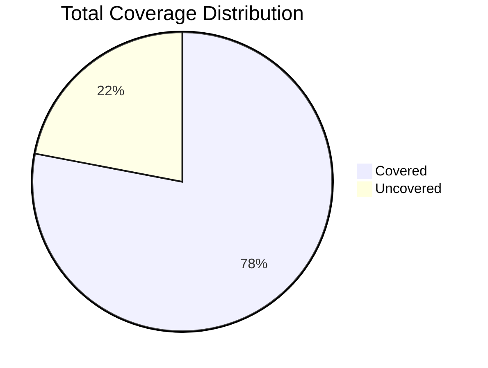
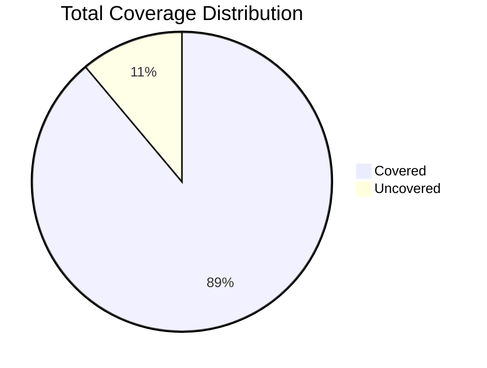
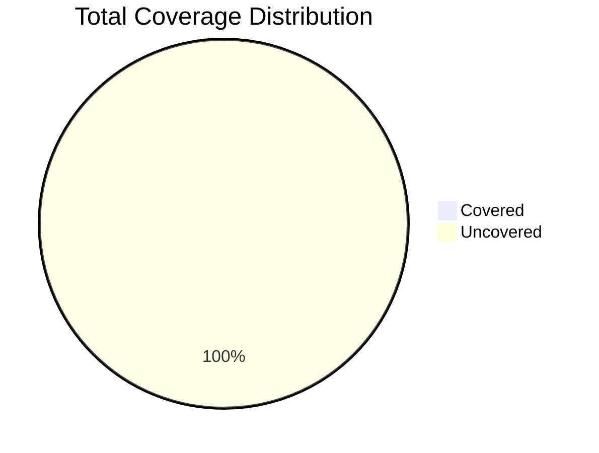

```mermaid
graph TD
    node0["src"]
    style node0 fill:#e0e0e0,stroke:#333,stroke-width:1px,stroke-dasharray: 5 5
    node1["Auth.js <br/> 0%"]
    style node1 fill:#f44336,stroke:#333,stroke-width:1px
    node0 --> node1
    node2["Database.js <br/> 0%"]
    style node2 fill:#f44336,stroke:#333,stroke-width:1px
    node0 --> node2
    node3["VoteRoom.js <br/> 0%"]
    style node3 fill:#f44336,stroke:#333,stroke-width:1px
    node0 --> node3
    node4["app.js <br/> 0%"]
    style node4 fill:#f44336,stroke:#333,stroke-width:1px
    node0 --> node4
    node5["engine"]
    style node5 fill:#e0e0e0,stroke:#333,stroke-width:1px,stroke-dasharray: 5 5
    node0 --> node5
    node6["Bench.js <br/> 5.4%"]
    style node6 fill:#f44336,stroke:#333,stroke-width:1px
    node5 --> node6
    node7["Bitboard.js <br/> 97.76%"]
    style node7 fill:#4caf50,stroke:#333,stroke-width:1px
    node5 --> node7
    node8["Board.js <br/> 96.37%"]
    style node8 fill:#4caf50,stroke:#333,stroke-width:1px
    node5 --> node8
    node9["BoardPerft.js <br/> 95.83%"]
    style node9 fill:#4caf50,stroke:#333,stroke-width:1px
    node5 --> node9
    node10["BoardVerify.js <br/> 75%"]
    style node10 fill:#ffeb3b,stroke:#333,stroke-width:1px
    node5 --> node10
    node11["BoardZobrist.js <br/> 98.79%"]
    style node11 fill:#4caf50,stroke:#333,stroke-width:1px
    node5 --> node11
    node12["Evaluation.js <br/> 96.3%"]
    style node12 fill:#4caf50,stroke:#333,stroke-width:1px
    node5 --> node12
    node13["EvaluationConstants.js <br/> 100%"]
    style node13 fill:#4caf50,stroke:#333,stroke-width:1px
    node5 --> node13
    node14["FenParser.js <br/> 98.21%"]
    style node14 fill:#4caf50,stroke:#333,stroke-width:1px
    node5 --> node14
    node15["MoveGenerator.js <br/> 98.42%"]
    style node15 fill:#4caf50,stroke:#333,stroke-width:1px
    node5 --> node15
    node16["MoveSorter.js <br/> 100%"]
    style node16 fill:#4caf50,stroke:#333,stroke-width:1px
    node5 --> node16
    node17["NNUE.js <br/> 74.63%"]
    style node17 fill:#ffeb3b,stroke:#333,stroke-width:1px
    node5 --> node17
    node18["PawnHash.js <br/> 100%"]
    style node18 fill:#4caf50,stroke:#333,stroke-width:1px
    node5 --> node18
    node19["PerftTT.js <br/> 100%"]
    style node19 fill:#4caf50,stroke:#333,stroke-width:1px
    node5 --> node19
    node20["Piece.js <br/> 100%"]
    style node20 fill:#4caf50,stroke:#333,stroke-width:1px
    node5 --> node20
    node21["Polyglot.js <br/> 84.05%"]
    style node21 fill:#4caf50,stroke:#333,stroke-width:1px
    node5 --> node21
    node22["PolyglotConstants.js <br/> 100%"]
    style node22 fill:#4caf50,stroke:#333,stroke-width:1px
    node5 --> node22
    node23["Quiescence.js <br/> 81.81%"]
    style node23 fill:#4caf50,stroke:#333,stroke-width:1px
    node5 --> node23
    node24["SEE.js <br/> 100%"]
    style node24 fill:#4caf50,stroke:#333,stroke-width:1px
    node5 --> node24
    node25["San.js <br/> 95%"]
    style node25 fill:#4caf50,stroke:#333,stroke-width:1px
    node5 --> node25
    node26["Search.js <br/> 83.5%"]
    style node26 fill:#4caf50,stroke:#333,stroke-width:1px
    node5 --> node26
    node27["SearchDebug.js <br/> 89.65%"]
    style node27 fill:#4caf50,stroke:#333,stroke-width:1px
    node5 --> node27
    node28["SearchHeuristics.js <br/> 91.66%"]
    style node28 fill:#4caf50,stroke:#333,stroke-width:1px
    node5 --> node28
    node29["SearchPruning.js <br/> 75%"]
    style node29 fill:#ffeb3b,stroke:#333,stroke-width:1px
    node5 --> node29
    node30["SearchUtils.js <br/> 79.62%"]
    style node30 fill:#ffeb3b,stroke:#333,stroke-width:1px
    node5 --> node30
    node31["StrengthLimiter.js <br/> 47.36%"]
    style node31 fill:#f44336,stroke:#333,stroke-width:1px
    node5 --> node31
    node32["Syzygy.js <br/> 72.72%"]
    style node32 fill:#ffeb3b,stroke:#333,stroke-width:1px
    node5 --> node32
    node33["TimeManager.js <br/> 97.14%"]
    style node33 fill:#4caf50,stroke:#333,stroke-width:1px
    node5 --> node33
    node34["TranspositionTable.js <br/> 82.08%"]
    style node34 fill:#4caf50,stroke:#333,stroke-width:1px
    node5 --> node34
    node35["UCI.js <br/> 85.09%"]
    style node35 fill:#4caf50,stroke:#333,stroke-width:1px
    node5 --> node35
    node36["Worker.js <br/> 0%"]
    style node36 fill:#f44336,stroke:#333,stroke-width:1px
    node5 --> node36
    node37["Zobrist.js <br/> 97.5%"]
    style node37 fill:#4caf50,stroke:#333,stroke-width:1px
    node5 --> node37
    node38["trace.js <br/> 66.66%"]
    style node38 fill:#ffeb3b,stroke:#333,stroke-width:1px
    node5 --> node38
    node39["engine.js <br/> 0%"]
    style node39 fill:#f44336,stroke:#333,stroke-width:1px
    node0 --> node39
    node40["plugins"]
    style node40 fill:#e0e0e0,stroke:#333,stroke-width:1px,stroke-dasharray: 5 5
    node0 --> node40
    node41["rbac.js <br/> 0%"]
    style node41 fill:#f44336,stroke:#333,stroke-width:1px
    node40 --> node41
    node42["websocket.js <br/> 0%"]
    style node42 fill:#f44336,stroke:#333,stroke-width:1px
    node40 --> node42
    node43["routes"]
    style node43 fill:#e0e0e0,stroke:#333,stroke-width:1px,stroke-dasharray: 5 5
    node0 --> node43
    node44["admin"]
    style node44 fill:#e0e0e0,stroke:#333,stroke-width:1px,stroke-dasharray: 5 5
    node43 --> node44
    node45["index.js <br/> 0%"]
    style node45 fill:#f44336,stroke:#333,stroke-width:1px
    node44 --> node45
    node46["api"]
    style node46 fill:#e0e0e0,stroke:#333,stroke-width:1px,stroke-dasharray: 5 5
    node43 --> node46
    node47["auth.js <br/> 0%"]
    style node47 fill:#f44336,stroke:#333,stroke-width:1px
    node46 --> node47
    node48["user.js <br/> 0%"]
    style node48 fill:#f44336,stroke:#333,stroke-width:1px
    node46 --> node48
    node49["misc.js <br/> 0%"]
    style node49 fill:#f44336,stroke:#333,stroke-width:1px
    node43 --> node49
    node50["root.js <br/> 0%"]
    style node50 fill:#f44336,stroke:#333,stroke-width:1px
    node43 --> node50
    node51["upload.js <br/> 0%"]
    style node51 fill:#f44336,stroke:#333,stroke-width:1px
    node43 --> node51
```

```mermaid
graph TD
    node0["src"]
    style node0 fill:#e0e0e0,stroke:#333,stroke-width:1px,stroke-dasharray: 5 5
    node1["engine"]
    style node1 fill:#e0e0e0,stroke:#333,stroke-width:1px,stroke-dasharray: 5 5
    node0 --> node1
    node2["Bench.js <br/> 5.4%"]
    style node2 fill:#f44336,stroke:#333,stroke-width:1px
    node1 --> node2
    node3["Bitboard.js <br/> 97.76%"]
    style node3 fill:#4caf50,stroke:#333,stroke-width:1px
    node1 --> node3
    node4["Board.js <br/> 96.37%"]
    style node4 fill:#4caf50,stroke:#333,stroke-width:1px
    node1 --> node4
    node5["BoardPerft.js <br/> 95.83%"]
    style node5 fill:#4caf50,stroke:#333,stroke-width:1px
    node1 --> node5
    node6["BoardVerify.js <br/> 75%"]
    style node6 fill:#ffeb3b,stroke:#333,stroke-width:1px
    node1 --> node6
    node7["BoardZobrist.js <br/> 98.79%"]
    style node7 fill:#4caf50,stroke:#333,stroke-width:1px
    node1 --> node7
    node8["Evaluation.js <br/> 96.3%"]
    style node8 fill:#4caf50,stroke:#333,stroke-width:1px
    node1 --> node8
    node9["EvaluationConstants.js <br/> 100%"]
    style node9 fill:#4caf50,stroke:#333,stroke-width:1px
    node1 --> node9
    node10["FenParser.js <br/> 98.21%"]
    style node10 fill:#4caf50,stroke:#333,stroke-width:1px
    node1 --> node10
    node11["MoveGenerator.js <br/> 98.42%"]
    style node11 fill:#4caf50,stroke:#333,stroke-width:1px
    node1 --> node11
    node12["MoveSorter.js <br/> 100%"]
    style node12 fill:#4caf50,stroke:#333,stroke-width:1px
    node1 --> node12
    node13["NNUE.js <br/> 74.63%"]
    style node13 fill:#ffeb3b,stroke:#333,stroke-width:1px
    node1 --> node13
    node14["PawnHash.js <br/> 100%"]
    style node14 fill:#4caf50,stroke:#333,stroke-width:1px
    node1 --> node14
    node15["PerftTT.js <br/> 100%"]
    style node15 fill:#4caf50,stroke:#333,stroke-width:1px
    node1 --> node15
    node16["Piece.js <br/> 100%"]
    style node16 fill:#4caf50,stroke:#333,stroke-width:1px
    node1 --> node16
    node17["Polyglot.js <br/> 84.05%"]
    style node17 fill:#4caf50,stroke:#333,stroke-width:1px
    node1 --> node17
    node18["PolyglotConstants.js <br/> 100%"]
    style node18 fill:#4caf50,stroke:#333,stroke-width:1px
    node1 --> node18
    node19["Quiescence.js <br/> 81.81%"]
    style node19 fill:#4caf50,stroke:#333,stroke-width:1px
    node1 --> node19
    node20["SEE.js <br/> 100%"]
    style node20 fill:#4caf50,stroke:#333,stroke-width:1px
    node1 --> node20
    node21["San.js <br/> 95%"]
    style node21 fill:#4caf50,stroke:#333,stroke-width:1px
    node1 --> node21
    node22["Search.js <br/> 83.5%"]
    style node22 fill:#4caf50,stroke:#333,stroke-width:1px
    node1 --> node22
    node23["SearchDebug.js <br/> 89.65%"]
    style node23 fill:#4caf50,stroke:#333,stroke-width:1px
    node1 --> node23
    node24["SearchHeuristics.js <br/> 91.66%"]
    style node24 fill:#4caf50,stroke:#333,stroke-width:1px
    node1 --> node24
    node25["SearchPruning.js <br/> 75%"]
    style node25 fill:#ffeb3b,stroke:#333,stroke-width:1px
    node1 --> node25
    node26["SearchUtils.js <br/> 79.62%"]
    style node26 fill:#ffeb3b,stroke:#333,stroke-width:1px
    node1 --> node26
    node27["StrengthLimiter.js <br/> 47.36%"]
    style node27 fill:#f44336,stroke:#333,stroke-width:1px
    node1 --> node27
    node28["Syzygy.js <br/> 72.72%"]
    style node28 fill:#ffeb3b,stroke:#333,stroke-width:1px
    node1 --> node28
    node29["TimeManager.js <br/> 97.14%"]
    style node29 fill:#4caf50,stroke:#333,stroke-width:1px
    node1 --> node29
    node30["TranspositionTable.js <br/> 82.08%"]
    style node30 fill:#4caf50,stroke:#333,stroke-width:1px
    node1 --> node30
    node31["UCI.js <br/> 85.09%"]
    style node31 fill:#4caf50,stroke:#333,stroke-width:1px
    node1 --> node31
    node32["Zobrist.js <br/> 97.5%"]
    style node32 fill:#4caf50,stroke:#333,stroke-width:1px
    node1 --> node32
    node33["trace.js <br/> 66.66%"]
    style node33 fill:#ffeb3b,stroke:#333,stroke-width:1px
    node1 --> node33
```

```mermaid
graph TD
    node0["src"]
    style node0 fill:#e0e0e0,stroke:#333,stroke-width:1px,stroke-dasharray: 5 5
    node1["Auth.js <br/> 0%"]
    style node1 fill:#f44336,stroke:#333,stroke-width:1px
    node0 --> node1
    node2["Database.js <br/> 0%"]
    style node2 fill:#f44336,stroke:#333,stroke-width:1px
    node0 --> node2
    node3["VoteRoom.js <br/> 0%"]
    style node3 fill:#f44336,stroke:#333,stroke-width:1px
    node0 --> node3
    node4["app.js <br/> 0%"]
    style node4 fill:#f44336,stroke:#333,stroke-width:1px
    node0 --> node4
    node5["engine"]
    style node5 fill:#e0e0e0,stroke:#333,stroke-width:1px,stroke-dasharray: 5 5
    node0 --> node5
    node6["Bench.js <br/> 0%"]
    style node6 fill:#f44336,stroke:#333,stroke-width:1px
    node5 --> node6
    node7["Bitboard.js <br/> 0%"]
    style node7 fill:#f44336,stroke:#333,stroke-width:1px
    node5 --> node7
    node8["Board.js <br/> 0%"]
    style node8 fill:#f44336,stroke:#333,stroke-width:1px
    node5 --> node8
    node9["BoardPerft.js <br/> 0%"]
    style node9 fill:#f44336,stroke:#333,stroke-width:1px
    node5 --> node9
    node10["BoardVerify.js <br/> 0%"]
    style node10 fill:#f44336,stroke:#333,stroke-width:1px
    node5 --> node10
    node11["BoardZobrist.js <br/> 0%"]
    style node11 fill:#f44336,stroke:#333,stroke-width:1px
    node5 --> node11
    node12["Evaluation.js <br/> 0%"]
    style node12 fill:#f44336,stroke:#333,stroke-width:1px
    node5 --> node12
    node13["EvaluationConstants.js <br/> 0%"]
    style node13 fill:#f44336,stroke:#333,stroke-width:1px
    node5 --> node13
    node14["FenParser.js <br/> 0%"]
    style node14 fill:#f44336,stroke:#333,stroke-width:1px
    node5 --> node14
    node15["MoveGenerator.js <br/> 0%"]
    style node15 fill:#f44336,stroke:#333,stroke-width:1px
    node5 --> node15
    node16["MoveSorter.js <br/> 0%"]
    style node16 fill:#f44336,stroke:#333,stroke-width:1px
    node5 --> node16
    node17["NNUE.js <br/> 0%"]
    style node17 fill:#f44336,stroke:#333,stroke-width:1px
    node5 --> node17
    node18["PawnHash.js <br/> 0%"]
    style node18 fill:#f44336,stroke:#333,stroke-width:1px
    node5 --> node18
    node19["PerftTT.js <br/> 0%"]
    style node19 fill:#f44336,stroke:#333,stroke-width:1px
    node5 --> node19
    node20["Piece.js <br/> 0%"]
    style node20 fill:#f44336,stroke:#333,stroke-width:1px
    node5 --> node20
    node21["Polyglot.js <br/> 0%"]
    style node21 fill:#f44336,stroke:#333,stroke-width:1px
    node5 --> node21
    node22["PolyglotConstants.js <br/> 0%"]
    style node22 fill:#f44336,stroke:#333,stroke-width:1px
    node5 --> node22
    node23["Quiescence.js <br/> 0%"]
    style node23 fill:#f44336,stroke:#333,stroke-width:1px
    node5 --> node23
    node24["SEE.js <br/> 0%"]
    style node24 fill:#f44336,stroke:#333,stroke-width:1px
    node5 --> node24
    node25["San.js <br/> 0%"]
    style node25 fill:#f44336,stroke:#333,stroke-width:1px
    node5 --> node25
    node26["Search.js <br/> 0%"]
    style node26 fill:#f44336,stroke:#333,stroke-width:1px
    node5 --> node26
    node27["SearchDebug.js <br/> 0%"]
    style node27 fill:#f44336,stroke:#333,stroke-width:1px
    node5 --> node27
    node28["SearchHeuristics.js <br/> 0%"]
    style node28 fill:#f44336,stroke:#333,stroke-width:1px
    node5 --> node28
    node29["SearchPruning.js <br/> 0%"]
    style node29 fill:#f44336,stroke:#333,stroke-width:1px
    node5 --> node29
    node30["SearchUtils.js <br/> 0%"]
    style node30 fill:#f44336,stroke:#333,stroke-width:1px
    node5 --> node30
    node31["StrengthLimiter.js <br/> 0%"]
    style node31 fill:#f44336,stroke:#333,stroke-width:1px
    node5 --> node31
    node32["Syzygy.js <br/> 0%"]
    style node32 fill:#f44336,stroke:#333,stroke-width:1px
    node5 --> node32
    node33["TimeManager.js <br/> 0%"]
    style node33 fill:#f44336,stroke:#333,stroke-width:1px
    node5 --> node33
    node34["TranspositionTable.js <br/> 0%"]
    style node34 fill:#f44336,stroke:#333,stroke-width:1px
    node5 --> node34
    node35["UCI.js <br/> 0%"]
    style node35 fill:#f44336,stroke:#333,stroke-width:1px
    node5 --> node35
    node36["Worker.js <br/> 0%"]
    style node36 fill:#f44336,stroke:#333,stroke-width:1px
    node5 --> node36
    node37["Zobrist.js <br/> 0%"]
    style node37 fill:#f44336,stroke:#333,stroke-width:1px
    node5 --> node37
    node38["trace.js <br/> 0%"]
    style node38 fill:#f44336,stroke:#333,stroke-width:1px
    node5 --> node38
    node39["engine.js <br/> 0%"]
    style node39 fill:#f44336,stroke:#333,stroke-width:1px
    node0 --> node39
    node40["plugins"]
    style node40 fill:#e0e0e0,stroke:#333,stroke-width:1px,stroke-dasharray: 5 5
    node0 --> node40
    node41["rbac.js <br/> 0%"]
    style node41 fill:#f44336,stroke:#333,stroke-width:1px
    node40 --> node41
    node42["websocket.js <br/> 0%"]
    style node42 fill:#f44336,stroke:#333,stroke-width:1px
    node40 --> node42
    node43["routes"]
    style node43 fill:#e0e0e0,stroke:#333,stroke-width:1px,stroke-dasharray: 5 5
    node0 --> node43
    node44["admin"]
    style node44 fill:#e0e0e0,stroke:#333,stroke-width:1px,stroke-dasharray: 5 5
    node43 --> node44
    node45["index.js <br/> 0%"]
    style node45 fill:#f44336,stroke:#333,stroke-width:1px
    node44 --> node45
    node46["api"]
    style node46 fill:#e0e0e0,stroke:#333,stroke-width:1px,stroke-dasharray: 5 5
    node43 --> node46
    node47["auth.js <br/> 0%"]
    style node47 fill:#f44336,stroke:#333,stroke-width:1px
    node46 --> node47
    node48["user.js <br/> 0%"]
    style node48 fill:#f44336,stroke:#333,stroke-width:1px
    node46 --> node48
    node49["misc.js <br/> 0%"]
    style node49 fill:#f44336,stroke:#333,stroke-width:1px
    node43 --> node49
    node50["root.js <br/> 0%"]
    style node50 fill:#f44336,stroke:#333,stroke-width:1px
    node43 --> node50
    node51["upload.js <br/> 0%"]
    style node51 fill:#f44336,stroke:#333,stroke-width:1px
    node43 --> node51
```

# Coverage Report

This report contains coverage data from Backend Unit Tests, E2E Tests, and a Unified view.

## Unified Coverage

## Summary

**Total Statement Coverage:** 78.02%

| Category | Percentage | Covered/Total |
|---|---|---|
| Statements | 78.02% | 2763/3541 |
| Branches | 74.74% | 1412/1889 |
| Functions | 77.57% | 384/495 |
| Lines | 78.9% | 2461/3119 |

## Visualizations

### Coverage Overview

### Coverage Pie Chart

## Backend Unit Tests Coverage

## Summary

**Total Statement Coverage:** 88.89%

| Category | Percentage | Covered/Total |
|---|---|---|
| Statements | 88.89% | 2763/3108 |
| Branches | 81.47% | 1412/1733 |
| Functions | 91.42% | 384/420 |
| Lines | 90.57% | 2461/2717 |

## Visualizations

### Coverage Overview

### Coverage Pie Chart

## E2E Tests Coverage

## Summary

**Total Statement Coverage:** 0%

| Category | Percentage | Covered/Total |
|---|---|---|
| Statements | 0% | 0/3541 |
| Branches | 0% | 0/1889 |
| Functions | 0% | 0/495 |
| Lines | 0% | 0/3119 |

## Visualizations

### Coverage Overview

### Coverage Pie Chart

