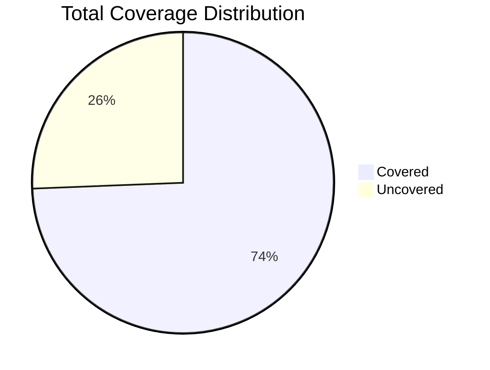
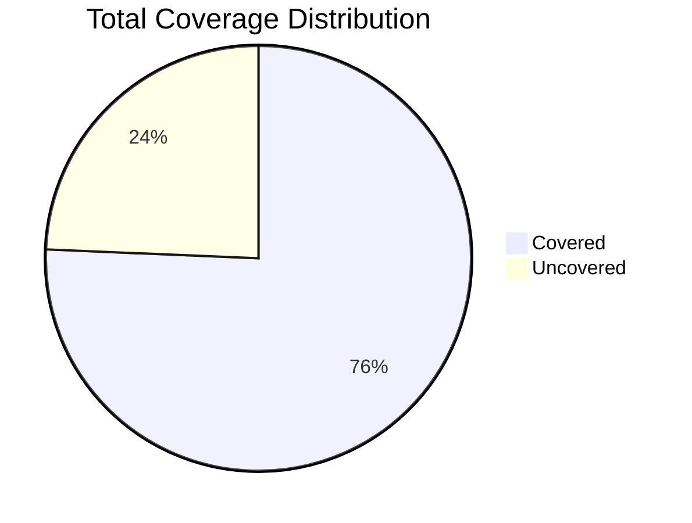
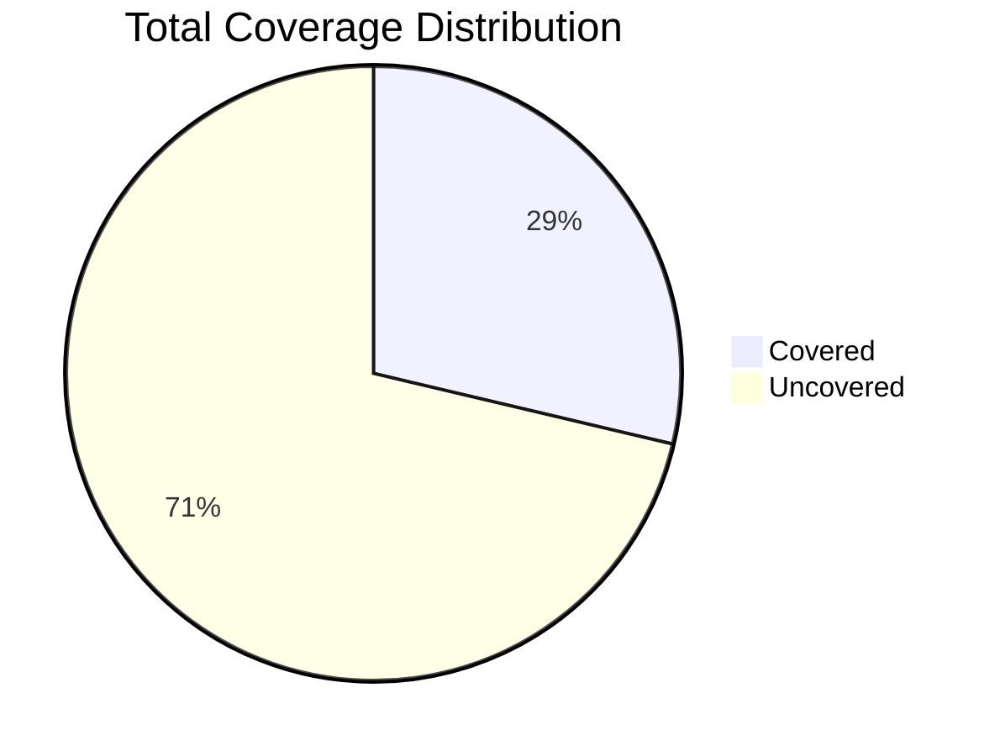

```mermaid
graph TD
    node0["public"]
    style node0 fill:#e0e0e0,stroke:#333,stroke-width:1px,stroke-dasharray: 5 5
    node1["client.js <br/> 68.05%"]
    style node1 fill:#ffeb3b,stroke:#333,stroke-width:1px
    node0 --> node1
    node2["js"]
    style node2 fill:#e0e0e0,stroke:#333,stroke-width:1px,stroke-dasharray: 5 5
    node0 --> node2
    node3["AccessibilityManager.js <br/> 88.62%"]
    style node3 fill:#4caf50,stroke:#333,stroke-width:1px
    node2 --> node3
    node4["AnalysisManager.js <br/> 88.82%"]
    style node4 fill:#4caf50,stroke:#333,stroke-width:1px
    node2 --> node4
    node5["ArrowManager.js <br/> 96.02%"]
    style node5 fill:#4caf50,stroke:#333,stroke-width:1px
    node2 --> node5
    node6["AuthManager.js <br/> 36.52%"]
    style node6 fill:#f44336,stroke:#333,stroke-width:1px
    node2 --> node6
    node7["AutoSaveManager.js <br/> 78.76%"]
    style node7 fill:#ffeb3b,stroke:#333,stroke-width:1px
    node2 --> node7
    node8["BatterySaver.js <br/> 79.31%"]
    style node8 fill:#ffeb3b,stroke:#333,stroke-width:1px
    node2 --> node8
    node9["BoardEditor.js <br/> 91.11%"]
    style node9 fill:#4caf50,stroke:#333,stroke-width:1px
    node2 --> node9
    node10["BoardInfoRenderer.js <br/> 95.47%"]
    style node10 fill:#4caf50,stroke:#333,stroke-width:1px
    node2 --> node10
    node11["BoardRenderer.js <br/> 75.92%"]
    style node11 fill:#ffeb3b,stroke:#333,stroke-width:1px
    node2 --> node11
    node12["ChatManager.js <br/> 60.41%"]
    style node12 fill:#ffeb3b,stroke:#333,stroke-width:1px
    node2 --> node12
    node13["ClientUtils.js <br/> 83.33%"]
    style node13 fill:#4caf50,stroke:#333,stroke-width:1px
    node2 --> node13
    node14["CloudEngineManager.js <br/> 24.67%"]
    style node14 fill:#f44336,stroke:#333,stroke-width:1px
    node2 --> node14
    node15["DeveloperManager.js <br/> 47.28%"]
    style node15 fill:#f44336,stroke:#333,stroke-width:1px
    node2 --> node15
    node16["EngineProxy.js <br/> 89.47%"]
    style node16 fill:#4caf50,stroke:#333,stroke-width:1px
    node2 --> node16
    node17["ExternalActions.js <br/> 57.48%"]
    style node17 fill:#ffeb3b,stroke:#333,stroke-width:1px
    node2 --> node17
    node18["FenManager.js <br/> 33.33%"]
    style node18 fill:#f44336,stroke:#333,stroke-width:1px
    node2 --> node18
    node19["GameManager.js <br/> 88.58%"]
    style node19 fill:#4caf50,stroke:#333,stroke-width:1px
    node2 --> node19
    node20["GraphManager.js <br/> 100%"]
    style node20 fill:#4caf50,stroke:#333,stroke-width:1px
    node2 --> node20
    node21["InfoManager.js <br/> 87.86%"]
    style node21 fill:#4caf50,stroke:#333,stroke-width:1px
    node2 --> node21
    node22["LanguageManager.js <br/> 94.73%"]
    style node22 fill:#4caf50,stroke:#333,stroke-width:1px
    node2 --> node22
    node23["LeaderboardManager.js <br/> 96.34%"]
    style node23 fill:#4caf50,stroke:#333,stroke-width:1px
    node2 --> node23
    node24["LocalEngineManager.js <br/> 26.08%"]
    style node24 fill:#f44336,stroke:#333,stroke-width:1px
    node2 --> node24
    node25["MoveHandler.js <br/> 93.77%"]
    style node25 fill:#4caf50,stroke:#333,stroke-width:1px
    node2 --> node25
    node26["MoveListManager.js <br/> 43.65%"]
    style node26 fill:#f44336,stroke:#333,stroke-width:1px
    node2 --> node26
    node27["OpeningExplorer.js <br/> 47.36%"]
    style node27 fill:#f44336,stroke:#333,stroke-width:1px
    node2 --> node27
    node28["PgnManager.js <br/> 30.33%"]
    style node28 fill:#f44336,stroke:#333,stroke-width:1px
    node2 --> node28
    node29["SettingsManager.js <br/> 63.12%"]
    style node29 fill:#ffeb3b,stroke:#333,stroke-width:1px
    node2 --> node29
    node30["SocketHandler.js <br/> 88.23%"]
    style node30 fill:#4caf50,stroke:#333,stroke-width:1px
    node2 --> node30
    node31["SoundManager.js <br/> 69.33%"]
    style node31 fill:#ffeb3b,stroke:#333,stroke-width:1px
    node2 --> node31
    node32["TrainingManager.js <br/> 90.47%"]
    style node32 fill:#4caf50,stroke:#333,stroke-width:1px
    node2 --> node32
    node33["TreeManager.js <br/> 18.78%"]
    style node33 fill:#f44336,stroke:#333,stroke-width:1px
    node2 --> node33
    node34["TutorialManager.js <br/> 31.13%"]
    style node34 fill:#f44336,stroke:#333,stroke-width:1px
    node2 --> node34
    node35["UIConstants.js <br/> 88%"]
    style node35 fill:#4caf50,stroke:#333,stroke-width:1px
    node2 --> node35
    node36["UIManager.js <br/> 82.42%"]
    style node36 fill:#4caf50,stroke:#333,stroke-width:1px
    node2 --> node36
    node37["UIOptionFactory.js <br/> 41.15%"]
    style node37 fill:#f44336,stroke:#333,stroke-width:1px
    node2 --> node37
    node38["VisualEffects.js <br/> 55.45%"]
    style node38 fill:#ffeb3b,stroke:#333,stroke-width:1px
    node2 --> node38
    node39["VisualizationManager.js <br/> 83.01%"]
    style node39 fill:#4caf50,stroke:#333,stroke-width:1px
    node2 --> node39
    node40["sw.js <br/> 0%"]
    style node40 fill:#f44336,stroke:#333,stroke-width:1px
    node0 --> node40
    node41["tournament.js <br/> 33.49%"]
    style node41 fill:#f44336,stroke:#333,stroke-width:1px
    node0 --> node41
    node42["src"]
    style node42 fill:#e0e0e0,stroke:#333,stroke-width:1px,stroke-dasharray: 5 5
    node43["Auth.js <br/> 0%"]
    style node43 fill:#f44336,stroke:#333,stroke-width:1px
    node42 --> node43
    node44["Database.js <br/> 0%"]
    style node44 fill:#f44336,stroke:#333,stroke-width:1px
    node42 --> node44
    node45["VoteRoom.js <br/> 0%"]
    style node45 fill:#f44336,stroke:#333,stroke-width:1px
    node42 --> node45
    node46["app.js <br/> 0%"]
    style node46 fill:#f44336,stroke:#333,stroke-width:1px
    node42 --> node46
    node47["engine"]
    style node47 fill:#e0e0e0,stroke:#333,stroke-width:1px,stroke-dasharray: 5 5
    node42 --> node47
    node48["Bench.js <br/> 5.4%"]
    style node48 fill:#f44336,stroke:#333,stroke-width:1px
    node47 --> node48
    node49["Bitboard.js <br/> 97.76%"]
    style node49 fill:#4caf50,stroke:#333,stroke-width:1px
    node47 --> node49
    node50["Board.js <br/> 96.37%"]
    style node50 fill:#4caf50,stroke:#333,stroke-width:1px
    node47 --> node50
    node51["BoardPerft.js <br/> 95.83%"]
    style node51 fill:#4caf50,stroke:#333,stroke-width:1px
    node47 --> node51
    node52["BoardVerify.js <br/> 75%"]
    style node52 fill:#ffeb3b,stroke:#333,stroke-width:1px
    node47 --> node52
    node53["BoardZobrist.js <br/> 98.79%"]
    style node53 fill:#4caf50,stroke:#333,stroke-width:1px
    node47 --> node53
    node54["Evaluation.js <br/> 96.3%"]
    style node54 fill:#4caf50,stroke:#333,stroke-width:1px
    node47 --> node54
    node55["EvaluationConstants.js <br/> 100%"]
    style node55 fill:#4caf50,stroke:#333,stroke-width:1px
    node47 --> node55
    node56["FenParser.js <br/> 98.21%"]
    style node56 fill:#4caf50,stroke:#333,stroke-width:1px
    node47 --> node56
    node57["MoveGenerator.js <br/> 98.42%"]
    style node57 fill:#4caf50,stroke:#333,stroke-width:1px
    node47 --> node57
    node58["MoveSorter.js <br/> 100%"]
    style node58 fill:#4caf50,stroke:#333,stroke-width:1px
    node47 --> node58
    node59["NNUE.js <br/> 74.63%"]
    style node59 fill:#ffeb3b,stroke:#333,stroke-width:1px
    node47 --> node59
    node60["PawnHash.js <br/> 100%"]
    style node60 fill:#4caf50,stroke:#333,stroke-width:1px
    node47 --> node60
    node61["PerftTT.js <br/> 100%"]
    style node61 fill:#4caf50,stroke:#333,stroke-width:1px
    node47 --> node61
    node62["Piece.js <br/> 100%"]
    style node62 fill:#4caf50,stroke:#333,stroke-width:1px
    node47 --> node62
    node63["Polyglot.js <br/> 84.05%"]
    style node63 fill:#4caf50,stroke:#333,stroke-width:1px
    node47 --> node63
    node64["PolyglotConstants.js <br/> 100%"]
    style node64 fill:#4caf50,stroke:#333,stroke-width:1px
    node47 --> node64
    node65["Quiescence.js <br/> 81.81%"]
    style node65 fill:#4caf50,stroke:#333,stroke-width:1px
    node47 --> node65
    node66["SEE.js <br/> 100%"]
    style node66 fill:#4caf50,stroke:#333,stroke-width:1px
    node47 --> node66
    node67["San.js <br/> 95%"]
    style node67 fill:#4caf50,stroke:#333,stroke-width:1px
    node47 --> node67
    node68["Search.js <br/> 83.5%"]
    style node68 fill:#4caf50,stroke:#333,stroke-width:1px
    node47 --> node68
    node69["SearchDebug.js <br/> 89.65%"]
    style node69 fill:#4caf50,stroke:#333,stroke-width:1px
    node47 --> node69
    node70["SearchHeuristics.js <br/> 91.66%"]
    style node70 fill:#4caf50,stroke:#333,stroke-width:1px
    node47 --> node70
    node71["SearchPruning.js <br/> 75%"]
    style node71 fill:#ffeb3b,stroke:#333,stroke-width:1px
    node47 --> node71
    node72["SearchUtils.js <br/> 79.62%"]
    style node72 fill:#ffeb3b,stroke:#333,stroke-width:1px
    node47 --> node72
    node73["StrengthLimiter.js <br/> 47.36%"]
    style node73 fill:#f44336,stroke:#333,stroke-width:1px
    node47 --> node73
    node74["Syzygy.js <br/> 72.72%"]
    style node74 fill:#ffeb3b,stroke:#333,stroke-width:1px
    node47 --> node74
    node75["TimeManager.js <br/> 97.14%"]
    style node75 fill:#4caf50,stroke:#333,stroke-width:1px
    node47 --> node75
    node76["TranspositionTable.js <br/> 82.08%"]
    style node76 fill:#4caf50,stroke:#333,stroke-width:1px
    node47 --> node76
    node77["UCI.js <br/> 86.27%"]
    style node77 fill:#4caf50,stroke:#333,stroke-width:1px
    node47 --> node77
    node78["Worker.js <br/> 0%"]
    style node78 fill:#f44336,stroke:#333,stroke-width:1px
    node47 --> node78
    node79["Zobrist.js <br/> 97.5%"]
    style node79 fill:#4caf50,stroke:#333,stroke-width:1px
    node47 --> node79
    node80["trace.js <br/> 66.66%"]
    style node80 fill:#ffeb3b,stroke:#333,stroke-width:1px
    node47 --> node80
    node81["engine.js <br/> 0%"]
    style node81 fill:#f44336,stroke:#333,stroke-width:1px
    node42 --> node81
    node82["plugins"]
    style node82 fill:#e0e0e0,stroke:#333,stroke-width:1px,stroke-dasharray: 5 5
    node42 --> node82
    node83["rbac.js <br/> 0%"]
    style node83 fill:#f44336,stroke:#333,stroke-width:1px
    node82 --> node83
    node84["websocket.js <br/> 0%"]
    style node84 fill:#f44336,stroke:#333,stroke-width:1px
    node82 --> node84
    node85["routes"]
    style node85 fill:#e0e0e0,stroke:#333,stroke-width:1px,stroke-dasharray: 5 5
    node42 --> node85
    node86["admin"]
    style node86 fill:#e0e0e0,stroke:#333,stroke-width:1px,stroke-dasharray: 5 5
    node85 --> node86
    node87["index.js <br/> 0%"]
    style node87 fill:#f44336,stroke:#333,stroke-width:1px
    node86 --> node87
    node88["api"]
    style node88 fill:#e0e0e0,stroke:#333,stroke-width:1px,stroke-dasharray: 5 5
    node85 --> node88
    node89["auth.js <br/> 0%"]
    style node89 fill:#f44336,stroke:#333,stroke-width:1px
    node88 --> node89
    node90["user.js <br/> 0%"]
    style node90 fill:#f44336,stroke:#333,stroke-width:1px
    node88 --> node90
    node91["misc.js <br/> 0%"]
    style node91 fill:#f44336,stroke:#333,stroke-width:1px
    node85 --> node91
    node92["root.js <br/> 0%"]
    style node92 fill:#f44336,stroke:#333,stroke-width:1px
    node85 --> node92
    node93["upload.js <br/> 0%"]
    style node93 fill:#f44336,stroke:#333,stroke-width:1px
    node85 --> node93
```

```mermaid
graph TD
    node0["public"]
    style node0 fill:#e0e0e0,stroke:#333,stroke-width:1px,stroke-dasharray: 5 5
    node1["client.js <br/> 38.02%"]
    style node1 fill:#f44336,stroke:#333,stroke-width:1px
    node0 --> node1
    node2["js"]
    style node2 fill:#e0e0e0,stroke:#333,stroke-width:1px,stroke-dasharray: 5 5
    node0 --> node2
    node3["AccessibilityManager.js <br/> 76.85%"]
    style node3 fill:#ffeb3b,stroke:#333,stroke-width:1px
    node2 --> node3
    node4["AnalysisManager.js <br/> 80.99%"]
    style node4 fill:#4caf50,stroke:#333,stroke-width:1px
    node2 --> node4
    node5["ArrowManager.js <br/> 87.96%"]
    style node5 fill:#4caf50,stroke:#333,stroke-width:1px
    node2 --> node5
    node6["AutoSaveManager.js <br/> 85.71%"]
    style node6 fill:#4caf50,stroke:#333,stroke-width:1px
    node2 --> node6
    node7["BatterySaver.js <br/> 83.33%"]
    style node7 fill:#4caf50,stroke:#333,stroke-width:1px
    node2 --> node7
    node8["BoardEditor.js <br/> 82.75%"]
    style node8 fill:#4caf50,stroke:#333,stroke-width:1px
    node2 --> node8
    node9["BoardInfoRenderer.js <br/> 73.91%"]
    style node9 fill:#ffeb3b,stroke:#333,stroke-width:1px
    node2 --> node9
    node10["BoardRenderer.js <br/> 61.63%"]
    style node10 fill:#ffeb3b,stroke:#333,stroke-width:1px
    node2 --> node10
    node11["ClientUtils.js <br/> 82.08%"]
    style node11 fill:#4caf50,stroke:#333,stroke-width:1px
    node2 --> node11
    node12["ExternalActions.js <br/> 38.14%"]
    style node12 fill:#f44336,stroke:#333,stroke-width:1px
    node2 --> node12
    node13["GameManager.js <br/> 79.58%"]
    style node13 fill:#ffeb3b,stroke:#333,stroke-width:1px
    node2 --> node13
    node14["GraphManager.js <br/> 91.33%"]
    style node14 fill:#4caf50,stroke:#333,stroke-width:1px
    node2 --> node14
    node15["InfoManager.js <br/> 82.75%"]
    style node15 fill:#4caf50,stroke:#333,stroke-width:1px
    node2 --> node15
    node16["LanguageManager.js <br/> 55.17%"]
    style node16 fill:#ffeb3b,stroke:#333,stroke-width:1px
    node2 --> node16
    node17["LeaderboardManager.js <br/> 90.32%"]
    style node17 fill:#4caf50,stroke:#333,stroke-width:1px
    node2 --> node17
    node18["MoveHandler.js <br/> 83.65%"]
    style node18 fill:#4caf50,stroke:#333,stroke-width:1px
    node2 --> node18
    node19["SettingsManager.js <br/> 59.01%"]
    style node19 fill:#ffeb3b,stroke:#333,stroke-width:1px
    node2 --> node19
    node20["SocketHandler.js <br/> 67.92%"]
    style node20 fill:#ffeb3b,stroke:#333,stroke-width:1px
    node2 --> node20
    node21["SoundManager.js <br/> 57.52%"]
    style node21 fill:#ffeb3b,stroke:#333,stroke-width:1px
    node2 --> node21
    node22["TrainingManager.js <br/> 84.31%"]
    style node22 fill:#4caf50,stroke:#333,stroke-width:1px
    node2 --> node22
    node23["UIConstants.js <br/> 20%"]
    style node23 fill:#f44336,stroke:#333,stroke-width:1px
    node2 --> node23
    node24["UIManager.js <br/> 57.48%"]
    style node24 fill:#ffeb3b,stroke:#333,stroke-width:1px
    node2 --> node24
    node25["UIOptionFactory.js <br/> 11.96%"]
    style node25 fill:#f44336,stroke:#333,stroke-width:1px
    node2 --> node25
    node26["VisualEffects.js <br/> 56.62%"]
    style node26 fill:#ffeb3b,stroke:#333,stroke-width:1px
    node2 --> node26
    node27["VisualizationManager.js <br/> 72.02%"]
    style node27 fill:#ffeb3b,stroke:#333,stroke-width:1px
    node2 --> node27
    node28["src"]
    style node28 fill:#e0e0e0,stroke:#333,stroke-width:1px,stroke-dasharray: 5 5
    node29["engine"]
    style node29 fill:#e0e0e0,stroke:#333,stroke-width:1px,stroke-dasharray: 5 5
    node28 --> node29
    node30["Bench.js <br/> 5.4%"]
    style node30 fill:#f44336,stroke:#333,stroke-width:1px
    node29 --> node30
    node31["Bitboard.js <br/> 97.76%"]
    style node31 fill:#4caf50,stroke:#333,stroke-width:1px
    node29 --> node31
    node32["Board.js <br/> 96.37%"]
    style node32 fill:#4caf50,stroke:#333,stroke-width:1px
    node29 --> node32
    node33["BoardPerft.js <br/> 95.83%"]
    style node33 fill:#4caf50,stroke:#333,stroke-width:1px
    node29 --> node33
    node34["BoardVerify.js <br/> 75%"]
    style node34 fill:#ffeb3b,stroke:#333,stroke-width:1px
    node29 --> node34
    node35["BoardZobrist.js <br/> 98.79%"]
    style node35 fill:#4caf50,stroke:#333,stroke-width:1px
    node29 --> node35
    node36["Evaluation.js <br/> 96.3%"]
    style node36 fill:#4caf50,stroke:#333,stroke-width:1px
    node29 --> node36
    node37["EvaluationConstants.js <br/> 100%"]
    style node37 fill:#4caf50,stroke:#333,stroke-width:1px
    node29 --> node37
    node38["FenParser.js <br/> 98.21%"]
    style node38 fill:#4caf50,stroke:#333,stroke-width:1px
    node29 --> node38
    node39["MoveGenerator.js <br/> 98.42%"]
    style node39 fill:#4caf50,stroke:#333,stroke-width:1px
    node29 --> node39
    node40["MoveSorter.js <br/> 100%"]
    style node40 fill:#4caf50,stroke:#333,stroke-width:1px
    node29 --> node40
    node41["NNUE.js <br/> 74.63%"]
    style node41 fill:#ffeb3b,stroke:#333,stroke-width:1px
    node29 --> node41
    node42["PawnHash.js <br/> 100%"]
    style node42 fill:#4caf50,stroke:#333,stroke-width:1px
    node29 --> node42
    node43["PerftTT.js <br/> 100%"]
    style node43 fill:#4caf50,stroke:#333,stroke-width:1px
    node29 --> node43
    node44["Piece.js <br/> 100%"]
    style node44 fill:#4caf50,stroke:#333,stroke-width:1px
    node29 --> node44
    node45["Polyglot.js <br/> 84.05%"]
    style node45 fill:#4caf50,stroke:#333,stroke-width:1px
    node29 --> node45
    node46["PolyglotConstants.js <br/> 100%"]
    style node46 fill:#4caf50,stroke:#333,stroke-width:1px
    node29 --> node46
    node47["Quiescence.js <br/> 81.81%"]
    style node47 fill:#4caf50,stroke:#333,stroke-width:1px
    node29 --> node47
    node48["SEE.js <br/> 100%"]
    style node48 fill:#4caf50,stroke:#333,stroke-width:1px
    node29 --> node48
    node49["San.js <br/> 95%"]
    style node49 fill:#4caf50,stroke:#333,stroke-width:1px
    node29 --> node49
    node50["Search.js <br/> 83.5%"]
    style node50 fill:#4caf50,stroke:#333,stroke-width:1px
    node29 --> node50
    node51["SearchDebug.js <br/> 89.65%"]
    style node51 fill:#4caf50,stroke:#333,stroke-width:1px
    node29 --> node51
    node52["SearchHeuristics.js <br/> 91.66%"]
    style node52 fill:#4caf50,stroke:#333,stroke-width:1px
    node29 --> node52
    node53["SearchPruning.js <br/> 75%"]
    style node53 fill:#ffeb3b,stroke:#333,stroke-width:1px
    node29 --> node53
    node54["SearchUtils.js <br/> 79.62%"]
    style node54 fill:#ffeb3b,stroke:#333,stroke-width:1px
    node29 --> node54
    node55["StrengthLimiter.js <br/> 47.36%"]
    style node55 fill:#f44336,stroke:#333,stroke-width:1px
    node29 --> node55
    node56["Syzygy.js <br/> 72.72%"]
    style node56 fill:#ffeb3b,stroke:#333,stroke-width:1px
    node29 --> node56
    node57["TimeManager.js <br/> 97.14%"]
    style node57 fill:#4caf50,stroke:#333,stroke-width:1px
    node29 --> node57
    node58["TranspositionTable.js <br/> 82.08%"]
    style node58 fill:#4caf50,stroke:#333,stroke-width:1px
    node29 --> node58
    node59["UCI.js <br/> 86.27%"]
    style node59 fill:#4caf50,stroke:#333,stroke-width:1px
    node29 --> node59
    node60["Zobrist.js <br/> 97.5%"]
    style node60 fill:#4caf50,stroke:#333,stroke-width:1px
    node29 --> node60
    node61["trace.js <br/> 66.66%"]
    style node61 fill:#ffeb3b,stroke:#333,stroke-width:1px
    node29 --> node61
```

```mermaid
graph TD
    node0["public"]
    style node0 fill:#e0e0e0,stroke:#333,stroke-width:1px,stroke-dasharray: 5 5
    node1["client.js <br/> 50.41%"]
    style node1 fill:#ffeb3b,stroke:#333,stroke-width:1px
    node0 --> node1
    node2["js"]
    style node2 fill:#e0e0e0,stroke:#333,stroke-width:1px,stroke-dasharray: 5 5
    node0 --> node2
    node3["AccessibilityManager.js <br/> 29.57%"]
    style node3 fill:#f44336,stroke:#333,stroke-width:1px
    node2 --> node3
    node4["AnalysisManager.js <br/> 22.85%"]
    style node4 fill:#f44336,stroke:#333,stroke-width:1px
    node2 --> node4
    node5["ArrowManager.js <br/> 38.65%"]
    style node5 fill:#f44336,stroke:#333,stroke-width:1px
    node2 --> node5
    node6["AuthManager.js <br/> 36.52%"]
    style node6 fill:#f44336,stroke:#333,stroke-width:1px
    node2 --> node6
    node7["AutoSaveManager.js <br/> 50%"]
    style node7 fill:#ffeb3b,stroke:#333,stroke-width:1px
    node2 --> node7
    node8["BatterySaver.js <br/> 33.33%"]
    style node8 fill:#f44336,stroke:#333,stroke-width:1px
    node2 --> node8
    node9["BoardEditor.js <br/> 51.53%"]
    style node9 fill:#ffeb3b,stroke:#333,stroke-width:1px
    node2 --> node9
    node10["BoardInfoRenderer.js <br/> 82.11%"]
    style node10 fill:#4caf50,stroke:#333,stroke-width:1px
    node2 --> node10
    node11["BoardRenderer.js <br/> 44.95%"]
    style node11 fill:#f44336,stroke:#333,stroke-width:1px
    node2 --> node11
    node12["ChatManager.js <br/> 60.41%"]
    style node12 fill:#ffeb3b,stroke:#333,stroke-width:1px
    node2 --> node12
    node13["ClientUtils.js <br/> 60%"]
    style node13 fill:#ffeb3b,stroke:#333,stroke-width:1px
    node2 --> node13
    node14["CloudEngineManager.js <br/> 24.67%"]
    style node14 fill:#f44336,stroke:#333,stroke-width:1px
    node2 --> node14
    node15["DeveloperManager.js <br/> 47.28%"]
    style node15 fill:#f44336,stroke:#333,stroke-width:1px
    node2 --> node15
    node16["EngineProxy.js <br/> 89.47%"]
    style node16 fill:#4caf50,stroke:#333,stroke-width:1px
    node2 --> node16
    node17["ExternalActions.js <br/> 18.47%"]
    style node17 fill:#f44336,stroke:#333,stroke-width:1px
    node2 --> node17
    node18["FenManager.js <br/> 33.33%"]
    style node18 fill:#f44336,stroke:#333,stroke-width:1px
    node2 --> node18
    node19["GameManager.js <br/> 43.26%"]
    style node19 fill:#f44336,stroke:#333,stroke-width:1px
    node2 --> node19
    node20["GraphManager.js <br/> 82.81%"]
    style node20 fill:#4caf50,stroke:#333,stroke-width:1px
    node2 --> node20
    node21["InfoManager.js <br/> 45.21%"]
    style node21 fill:#f44336,stroke:#333,stroke-width:1px
    node2 --> node21
    node22["LanguageManager.js <br/> 95.19%"]
    style node22 fill:#4caf50,stroke:#333,stroke-width:1px
    node2 --> node22
    node23["LeaderboardManager.js <br/> 21.56%"]
    style node23 fill:#f44336,stroke:#333,stroke-width:1px
    node2 --> node23
    node24["LocalEngineManager.js <br/> 26.08%"]
    style node24 fill:#f44336,stroke:#333,stroke-width:1px
    node2 --> node24
    node25["MoveHandler.js <br/> 21.3%"]
    style node25 fill:#f44336,stroke:#333,stroke-width:1px
    node2 --> node25
    node26["MoveListManager.js <br/> 43.65%"]
    style node26 fill:#f44336,stroke:#333,stroke-width:1px
    node2 --> node26
    node27["OpeningExplorer.js <br/> 47.36%"]
    style node27 fill:#f44336,stroke:#333,stroke-width:1px
    node2 --> node27
    node28["PgnManager.js <br/> 30.33%"]
    style node28 fill:#f44336,stroke:#333,stroke-width:1px
    node2 --> node28
    node29["SettingsManager.js <br/> 54.74%"]
    style node29 fill:#ffeb3b,stroke:#333,stroke-width:1px
    node2 --> node29
    node30["SocketHandler.js <br/> 44.57%"]
    style node30 fill:#f44336,stroke:#333,stroke-width:1px
    node2 --> node30
    node31["SoundManager.js <br/> 36.36%"]
    style node31 fill:#f44336,stroke:#333,stroke-width:1px
    node2 --> node31
    node32["TrainingManager.js <br/> 28.86%"]
    style node32 fill:#f44336,stroke:#333,stroke-width:1px
    node2 --> node32
    node33["TreeManager.js <br/> 18.78%"]
    style node33 fill:#f44336,stroke:#333,stroke-width:1px
    node2 --> node33
    node34["TutorialManager.js <br/> 31.13%"]
    style node34 fill:#f44336,stroke:#333,stroke-width:1px
    node2 --> node34
    node35["UIConstants.js <br/> 88.88%"]
    style node35 fill:#4caf50,stroke:#333,stroke-width:1px
    node2 --> node35
    node36["UIManager.js <br/> 48.96%"]
    style node36 fill:#f44336,stroke:#333,stroke-width:1px
    node2 --> node36
    node37["UIOptionFactory.js <br/> 13.98%"]
    style node37 fill:#f44336,stroke:#333,stroke-width:1px
    node2 --> node37
    node38["VisualEffects.js <br/> 24.08%"]
    style node38 fill:#f44336,stroke:#333,stroke-width:1px
    node2 --> node38
    node39["VisualizationManager.js <br/> 30.57%"]
    style node39 fill:#f44336,stroke:#333,stroke-width:1px
    node2 --> node39
    node40["sw.js <br/> 0%"]
    style node40 fill:#f44336,stroke:#333,stroke-width:1px
    node0 --> node40
    node41["tournament.js <br/> 33.49%"]
    style node41 fill:#f44336,stroke:#333,stroke-width:1px
    node0 --> node41
    node42["src"]
    style node42 fill:#e0e0e0,stroke:#333,stroke-width:1px,stroke-dasharray: 5 5
    node43["Auth.js <br/> 0%"]
    style node43 fill:#f44336,stroke:#333,stroke-width:1px
    node42 --> node43
    node44["Database.js <br/> 0%"]
    style node44 fill:#f44336,stroke:#333,stroke-width:1px
    node42 --> node44
    node45["VoteRoom.js <br/> 0%"]
    style node45 fill:#f44336,stroke:#333,stroke-width:1px
    node42 --> node45
    node46["app.js <br/> 0%"]
    style node46 fill:#f44336,stroke:#333,stroke-width:1px
    node42 --> node46
    node47["engine"]
    style node47 fill:#e0e0e0,stroke:#333,stroke-width:1px,stroke-dasharray: 5 5
    node42 --> node47
    node48["Bench.js <br/> 0%"]
    style node48 fill:#f44336,stroke:#333,stroke-width:1px
    node47 --> node48
    node49["Bitboard.js <br/> 0%"]
    style node49 fill:#f44336,stroke:#333,stroke-width:1px
    node47 --> node49
    node50["Board.js <br/> 0%"]
    style node50 fill:#f44336,stroke:#333,stroke-width:1px
    node47 --> node50
    node51["BoardPerft.js <br/> 0%"]
    style node51 fill:#f44336,stroke:#333,stroke-width:1px
    node47 --> node51
    node52["BoardVerify.js <br/> 0%"]
    style node52 fill:#f44336,stroke:#333,stroke-width:1px
    node47 --> node52
    node53["BoardZobrist.js <br/> 0%"]
    style node53 fill:#f44336,stroke:#333,stroke-width:1px
    node47 --> node53
    node54["Evaluation.js <br/> 0%"]
    style node54 fill:#f44336,stroke:#333,stroke-width:1px
    node47 --> node54
    node55["EvaluationConstants.js <br/> 0%"]
    style node55 fill:#f44336,stroke:#333,stroke-width:1px
    node47 --> node55
    node56["FenParser.js <br/> 0%"]
    style node56 fill:#f44336,stroke:#333,stroke-width:1px
    node47 --> node56
    node57["MoveGenerator.js <br/> 0%"]
    style node57 fill:#f44336,stroke:#333,stroke-width:1px
    node47 --> node57
    node58["MoveSorter.js <br/> 0%"]
    style node58 fill:#f44336,stroke:#333,stroke-width:1px
    node47 --> node58
    node59["NNUE.js <br/> 0%"]
    style node59 fill:#f44336,stroke:#333,stroke-width:1px
    node47 --> node59
    node60["PawnHash.js <br/> 0%"]
    style node60 fill:#f44336,stroke:#333,stroke-width:1px
    node47 --> node60
    node61["PerftTT.js <br/> 0%"]
    style node61 fill:#f44336,stroke:#333,stroke-width:1px
    node47 --> node61
    node62["Piece.js <br/> 0%"]
    style node62 fill:#f44336,stroke:#333,stroke-width:1px
    node47 --> node62
    node63["Polyglot.js <br/> 0%"]
    style node63 fill:#f44336,stroke:#333,stroke-width:1px
    node47 --> node63
    node64["PolyglotConstants.js <br/> 0%"]
    style node64 fill:#f44336,stroke:#333,stroke-width:1px
    node47 --> node64
    node65["Quiescence.js <br/> 0%"]
    style node65 fill:#f44336,stroke:#333,stroke-width:1px
    node47 --> node65
    node66["SEE.js <br/> 0%"]
    style node66 fill:#f44336,stroke:#333,stroke-width:1px
    node47 --> node66
    node67["San.js <br/> 0%"]
    style node67 fill:#f44336,stroke:#333,stroke-width:1px
    node47 --> node67
    node68["Search.js <br/> 0%"]
    style node68 fill:#f44336,stroke:#333,stroke-width:1px
    node47 --> node68
    node69["SearchDebug.js <br/> 0%"]
    style node69 fill:#f44336,stroke:#333,stroke-width:1px
    node47 --> node69
    node70["SearchHeuristics.js <br/> 0%"]
    style node70 fill:#f44336,stroke:#333,stroke-width:1px
    node47 --> node70
    node71["SearchPruning.js <br/> 0%"]
    style node71 fill:#f44336,stroke:#333,stroke-width:1px
    node47 --> node71
    node72["SearchUtils.js <br/> 0%"]
    style node72 fill:#f44336,stroke:#333,stroke-width:1px
    node47 --> node72
    node73["StrengthLimiter.js <br/> 0%"]
    style node73 fill:#f44336,stroke:#333,stroke-width:1px
    node47 --> node73
    node74["Syzygy.js <br/> 0%"]
    style node74 fill:#f44336,stroke:#333,stroke-width:1px
    node47 --> node74
    node75["TimeManager.js <br/> 0%"]
    style node75 fill:#f44336,stroke:#333,stroke-width:1px
    node47 --> node75
    node76["TranspositionTable.js <br/> 0%"]
    style node76 fill:#f44336,stroke:#333,stroke-width:1px
    node47 --> node76
    node77["UCI.js <br/> 0%"]
    style node77 fill:#f44336,stroke:#333,stroke-width:1px
    node47 --> node77
    node78["Worker.js <br/> 0%"]
    style node78 fill:#f44336,stroke:#333,stroke-width:1px
    node47 --> node78
    node79["Zobrist.js <br/> 0%"]
    style node79 fill:#f44336,stroke:#333,stroke-width:1px
    node47 --> node79
    node80["trace.js <br/> 0%"]
    style node80 fill:#f44336,stroke:#333,stroke-width:1px
    node47 --> node80
    node81["engine.js <br/> 0%"]
    style node81 fill:#f44336,stroke:#333,stroke-width:1px
    node42 --> node81
    node82["plugins"]
    style node82 fill:#e0e0e0,stroke:#333,stroke-width:1px,stroke-dasharray: 5 5
    node42 --> node82
    node83["rbac.js <br/> 0%"]
    style node83 fill:#f44336,stroke:#333,stroke-width:1px
    node82 --> node83
    node84["websocket.js <br/> 0%"]
    style node84 fill:#f44336,stroke:#333,stroke-width:1px
    node82 --> node84
    node85["routes"]
    style node85 fill:#e0e0e0,stroke:#333,stroke-width:1px,stroke-dasharray: 5 5
    node42 --> node85
    node86["admin"]
    style node86 fill:#e0e0e0,stroke:#333,stroke-width:1px,stroke-dasharray: 5 5
    node85 --> node86
    node87["index.js <br/> 0%"]
    style node87 fill:#f44336,stroke:#333,stroke-width:1px
    node86 --> node87
    node88["api"]
    style node88 fill:#e0e0e0,stroke:#333,stroke-width:1px,stroke-dasharray: 5 5
    node85 --> node88
    node89["auth.js <br/> 0%"]
    style node89 fill:#f44336,stroke:#333,stroke-width:1px
    node88 --> node89
    node90["user.js <br/> 0%"]
    style node90 fill:#f44336,stroke:#333,stroke-width:1px
    node88 --> node90
    node91["misc.js <br/> 0%"]
    style node91 fill:#f44336,stroke:#333,stroke-width:1px
    node85 --> node91
    node92["root.js <br/> 0%"]
    style node92 fill:#f44336,stroke:#333,stroke-width:1px
    node85 --> node92
    node93["upload.js <br/> 0%"]
    style node93 fill:#f44336,stroke:#333,stroke-width:1px
    node85 --> node93
```

# Coverage Report

This report contains coverage data from Backend Unit Tests, E2E Tests, and a Unified view.

## Unified Coverage

## Summary

**Total Statement Coverage:** 74.38%

| Category | Percentage | Covered/Total |
|---|---|---|
| Statements | 74.38% | 10805/14525 |
| Branches | 75.14% | 2894/3851 |
| Functions | 69.46% | 1190/1713 |
| Lines | 76.61% | 8025/10475 |

## Visualizations

### Coverage Overview

### Coverage Pie Chart

## Backend Unit Tests Coverage

## Summary

**Total Statement Coverage:** 75.67%

| Category | Percentage | Covered/Total |
|---|---|---|
| Statements | 75.67% | 5097/6735 |
| Branches | 66.05% | 2199/3329 |
| Functions | 67.08% | 750/1118 |
| Lines | 78.36% | 4582/5847 |

## Visualizations

### Coverage Overview

### Coverage Pie Chart

## E2E Tests Coverage

## Summary

**Total Statement Coverage:** 28.69%

| Category | Percentage | Covered/Total |
|---|---|---|
| Statements | 28.69% | 3128/10899 |
| Branches | 13.83% | 312/2255 |
| Functions | 13.89% | 141/1015 |
| Lines | 29.86% | 3128/10475 |

## Visualizations

### Coverage Overview

### Coverage Pie Chart

