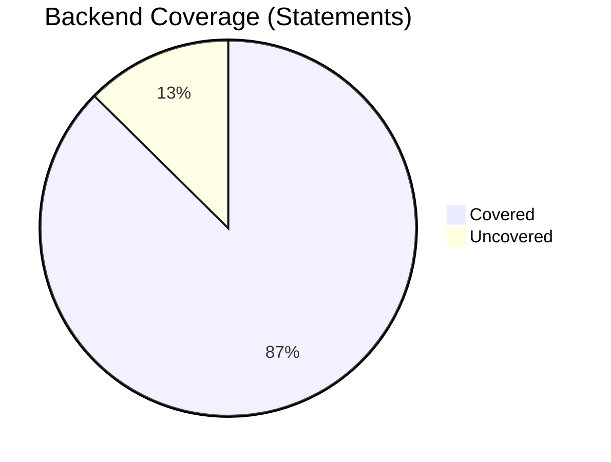
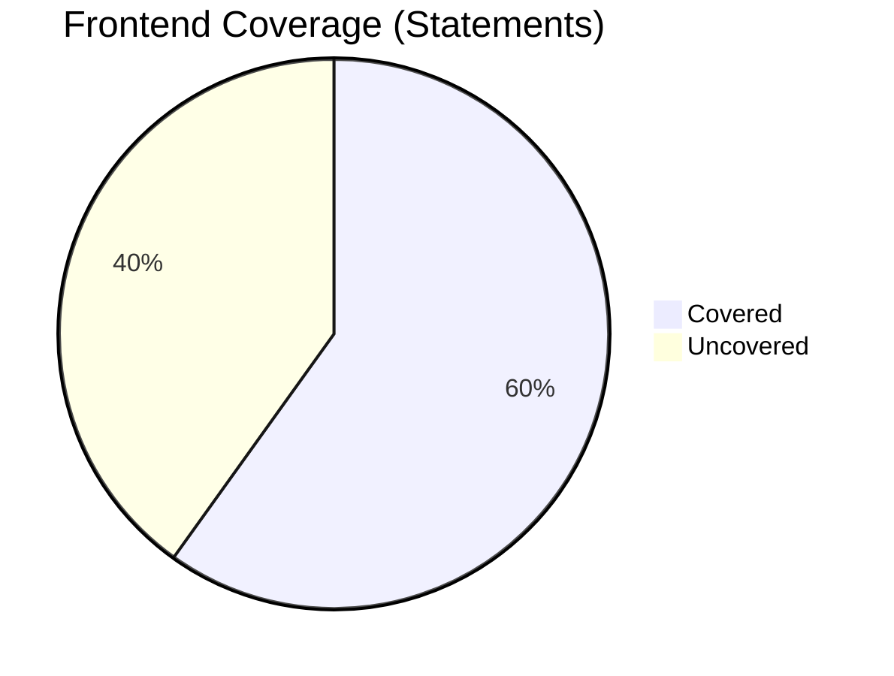

# Coverage Report

## Summary

This report summarizes the code coverage for the backend and frontend components of the Jules & Gemini Chess Engine.

**Backend (src/)**: ~87.4% Statement Coverage
**Frontend (public/)**: ~59.9% Statement Coverage

## Diagrams

### Backend Coverage

### Frontend Coverage

## Detailed Breakdown

### Backend (`src/`)

| File | Statements | Branches | Functions | Lines |
|---|---|---|---|---|
| Bitboard.js | 97.76% | 94.73% | 100% | 99.01% |
| Board.js | 96.37% | 94.87% | 100% | 96.68% |
| Evaluation.js | 96.3% | 92.3% | 100% | 97.28% |
| MoveGenerator.js | 98.42% | 96.72% | 100% | 100% |
| NNUE.js | 74.63% | 50.56% | 71.42% | 79.31% |
| Search.js | 83.5% | 73.25% | 91.66% | 87.53% |
| UCI.js | 87% | 72.41% | 81.48% | 87.71% |

### Frontend (`public/`)

| File | Statements | Branches | Functions | Lines |
|---|---|---|---|---|
| client.js | 87.75% | 70.21% | 79.24% | 87.95% |
| js/GameManager.js | 91.4% | 85.05% | 96.66% | 91.33% |
| js/MoveHandler.js | 88.05% | 72.5% | 100% | 91.66% |
| js/UIManager.js | 51.52% | 22.82% | 34.69% | 51.56% |

*Note: The frontend coverage includes logic-heavy components like `GameManager` and `MoveHandler`, which are well-tested. Lower coverage in `UIManager` is expected due to the difficulty of testing complex DOM interactions without extensive E2E suites.*
