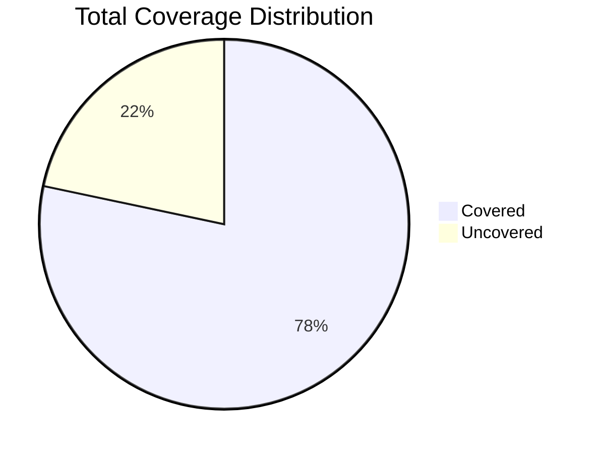

# Unified Coverage Report

## Summary

**Total Statement Coverage:** 78.32%

| Category | Percentage | Covered/Total |
|---|---|---|
| Statements | 78.32% | 2768/3534 |
| Branches | 74.9% | 1412/1885 |
| Functions | 77.73% | 384/494 |
| Lines | 79.24% | 2466/3112 |

## Visualizations

### Coverage Overview

### Coverage Pie Chart

